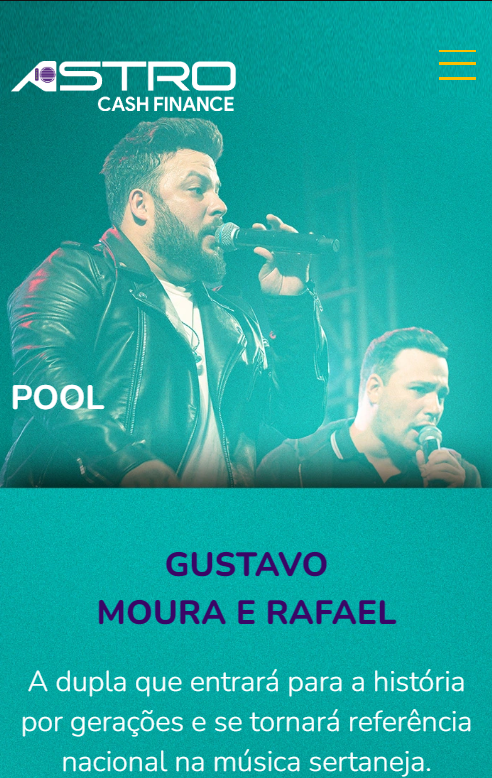

  <h2 align="center">Pool Gmr</h2>

  

   Neste projeto de dois meses, realizei a migração de uma página WordPress para HTML e CSS, visando torná-la mais leve e personalizada. <br/ > O resultado foi uma página mais eficiente em termos de desempenho, mantendo um design atraente e satisfazendo plenamente as necessidades do cliente.
     
    <a href="https://astrocash.finance/pool-grm/"><strong>Visualizar o projeto »</strong></a>
     
     
  

  
<b>Versão Web

  
    
    
    
    
   
<b>Versão Mobile

  

 
 

## ☕ Como Usar
Você pode visualizar a página abrindo o arquivo `index.html` em um navegador da web. Certifique-se de que todos os arquivos CSS, imagens e fontes estejam na mesma pasta ou diretório.
 
 

## 📂 Estrutura do Projeto

- `index.html`: O arquivo principal que contém o conteúdo da página.
- `src/style/`: A pasta que contém os arquivos CSS para estilizar a página, resetar e a versão Mobile
- `src/images/`: A pasta que contém imagens usadas na página.
 

## 🚀 Tecnologias Utilizadas

* HTML
* CSS
 

## 👩🏽‍💻 Autora

Este projeto foi criado para um cliente Freelancer, onde realizei 2 projetos.
 
 

## 📝 Licença

Este projeto está sob a licença  [Licença MIT](license.md). Você pode obter mais informações sobre a licença no arquivo LICENSE.
 
 
